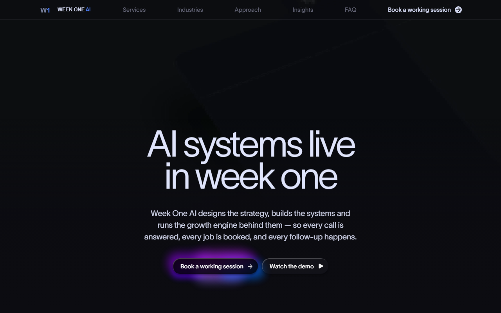

# Week One AI

The Week One AI website — a static, self-contained build. Every asset is served
from this folder; the site makes no external network requests at runtime.



## Screens

| | |
|---|---|
| [Services](docs/screenshots/02-services.png) | five sections, with navigation that tracks the section in view |
| [Industries](docs/screenshots/03-industries.png) | nine verticals, each expanding to its capabilities |
| [Approach](docs/screenshots/04-approach.png) | the method — four phases, four artifacts |
| [Insights](docs/screenshots/05-insights.png) | article index |
| [Article](docs/screenshots/07-insight-article.png) | long-form essay layout |
| [Contact](docs/screenshots/06-contact.png) | working session, email and voice line |

A scroll-through of the Services page:
[`docs/media/services-walkthrough.mp4`](docs/media/services-walkthrough.mp4).
The product explainer behind "Watch the demo" is at
`assets/weekoneai.com/media/weekone-explainer-720p-v2.mp4` — 720p, 72 seconds.

The home page hero is scroll-driven, so a static capture only catches its first
frame. Run the site to see it move.

## Run it

```bash
node serve.mjs 8099
# then open http://localhost:8099/
```

The server normalises trailing slashes (`/services/` → `/services`), which the
page-relative links depend on. Any static host with the same behaviour works.

## Pages

| Route | |
|---|---|
| `/` | Home |
| `/services` | Services — five sections with in-page navigation |
| `/industries` | Industries — nine verticals |
| `/approach` | Approach — the method, four phases |
| `/insights` | Insights — article index |
| `/insights` → `/blog/vision` | *Speed Is the New Moat* |
| `/insights` → `/blog/pre-seed-announcement` | *The Economics of a Missed Call* |
| `/faq` `/contact` `/brand` `/privacy` `/terms` | Supporting pages |

## Layout

```
assets/
  cdn/        application bundles, images, fonts and video
  fonts/      webfont files
  vendor/     third-party libraries
  weekoneai.com/
              brand media — explainer video, hero footage, article imagery
  local/      site-specific CSS and behaviour (see below)
```

### `assets/local/`

Small additions layered on top of the page bundles. Each file starts with a
comment explaining what it does and why.

| File | |
|---|---|
| `industries-verticals.*` | Renders the nine verticals on `/industries` |
| `services-nav.*` | In-page navigation for the Services sections |
| `approach-images.css` | Imagery for the Approach page |
| `approach-cleanup.*` | Removes unused template blocks |
| `blog-article.css` | Article hero and byline treatment |
| `insights-nav.css` | Current-page highlight in the header |
| `demo-video.*` | "Watch the demo" overlay player |
| `booking.*` | Sends every "Book a working session" to `/contact`, and puts the voice line beside the email address there |

These run after the page hydrates and re-apply themselves if a re-render
disturbs them, so they survive client-side navigation.

## Notes

- No analytics, advertising pixels, or third-party embeds. Verified: zero
  external requests on every page.
- The explainer at `assets/weekoneai.com/media/` is 720p H.264, 72 seconds.
- Media is sized per slot; images are preloaded where a late decode would show.
